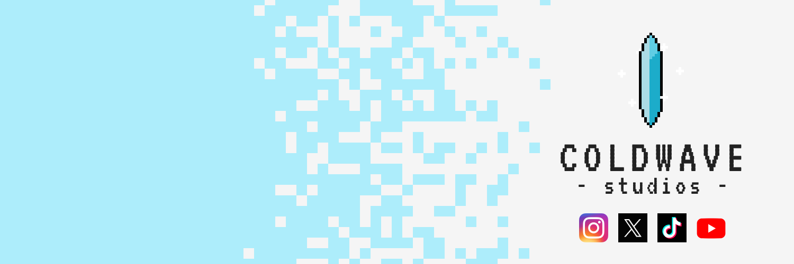

# ColdWave Studios

Hi! My name is Russ, and I am the guy behind ColdWave Studios.

One of my life goals is to make video games. Gaming has been my passion since I was a kid. Video games were always the thing I could just decompress with and relax. Being able to contribute to this world of video games would be a dream come true.

I set up ColdWave Studios to be a place where I can aggregate all of my learning, projects, and anything else for my journey in learning video game development.

## Where you can find me

- [Instagram](https://www.instagram.com/coldwave.studios/) - Post images of game assets or art.
- [Twitter/X](https://x.com/ColdWaveStudios) - Post ramblings and various pieces of art, code, or games I am working on.
- [TikTok](https://www.tiktok.com/@coldwavestudios?_t=8mxRNYRx7Tb&_r=1) - Post weekly updates on what I am doing.
- [YouTube](https://www.youtube.com/channel/UCZYYBsdQ4WmXQD_KXdyK06Q) - Not yet active. 

# A little about me

Hi, I'm Russ. I have a background in development and hold a bachelor's degree in software development, although I don't use it for work. It seems pretty common for people to not use their degrees. Oh well. After graduating from college, I changed direction and taught myself front-end web development. I found web development to be a bit more interesting than software development. I've always been drawn to the creative side of things, and I think UI/UX design is what attracted me to web development.

On the flip side, I have next to no design or art background. I am currently in the process of learning how to draw, as it's something I've always wanted to learn. Additionally, I am learning pixel art. Currently, 2D/Pixel Art games are what I want to work on. There's potential I might dabble in 3D in the future, but for now, I want to stick to 2D. I have always had a fascination with pixel art and seeing some of the cool things people come up with. Some of my inspirations in pixel art are [Brandon James Greer](https://www.youtube.com/@BJGpixel), [AdamCYounis](https://www.youtube.com/@AdamCYounis), and  [Pixel Pete](https://www.youtube.com/@PeterMilko).

## Tools I am using

- Godot 4
- Aseprite
- Affinity Photo
- Affinity Designer
- Procreate

## Other fun facts about me

- Some other hobbies of mine include kayaking, photography, and 3D printing.
- I am a collector of video games and currently have roughly 1,100 physical games ranging from the NES to PS5.
- I love metal and metalcore music, especially bands like Beartooth, Memphis May Fire, Architecets, and Polaris.
- I’m an occasional trophy hunter in games, depending how easy the platinum is.
- I’m also interested in D&D and enjoy creating and playing campaigns with friends.

# Current Projects

## Vampire Survivors Clone

### Description

I am going through the tutorial series on YouTube by [Branno](https://www.youtube.com/@BrannoDev) on creating a clone of [Vampire Survivors](https://www.youtube.com/watch?v=GFeHlz31KRk) in Godot. You can find his playlist [here](https://www.youtube.com/playlist?list=PLtosjGHWDab682nfZ1f6JSQ1cjap7Ieeb) on the tutorial series. You can find a GitHub repo for what I am doing with this [here](https://github.com/ColdWave-Stuidos/Survivors_Clone).

### Progress
You can refer to the readme on the [Survivors Clone GitHub repo](https://github.com/ColdWave-Stuidos/Survivors_Clone) for detailed progress, but I am pretty much done with the tutorial itself, and am going to be working on adding some of my own attacks and items to the game to get some practice without needing to follow a tutorial.

## Pixel Art Portfolio

### Description

A collection of my pixel art creations as I learn and improve

### Related Repos

I am going to be doing challenges as well as having my own portfolio for this that I will upload to GitHub in the future.

**Challenges**

- [Septembit 2020](https://github.com/ColdWave-Stuidos/SeptemBIT_2020)

# Learning Resources

## Pixel Art

- [Saultoons](https://www.youtube.com/@saultoons)
- [Brandon James Greer YouTube Channel](https://www.youtube.com/@BJGpixel)
- [AdamCYounis YouTube Channel](https://www.youtube.com/@AdamCYounis)
- [Pixel Pete YouTube Channel](https://www.youtube.com/@PeterMilko)

## Game Dev (Godot)

- [Branno](https://www.youtube.com/@BrannoDev)
- [Brackeys](https://www.youtube.com/@Brackeys)

## Documentation

- [Godot Documentation](https://docs.godotengine.org/en/stable/)
- [Aseprite Tutorials](https://www.aseprite.org/docs/)

# Contact Information

Feel free to reach out to me via [Twitter](https://x.com/ColdWaveStudios) or [Instagram](https://www.instagram.com/coldwave.studios/). I’m always open to connect with fellow developers and artists!